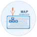

# Map Animation

`ctrl + click` to run [demos](https://isocialpractice.github.io/map-animation/index.html).

 A collection of simple, self-contained game-engine elements built with vanilla JavaScript and HTML5. Each folder is a standalone demo that maps keyboard and mouse controls to a playable animation or interactive tool. Folders are named as minimal descriptions of the mapped animation or tool purpose.

Each element is designed to be plugged into any compatible element, allowing them to be composed together for more grandiose gameplay.

## Elements

### jet-engine-flame

A Three.js 3D interactive demo featuring procedural flame animation on a jet model. Supports camera orbit, zoom, pan, and an animation editor with transform gizmos for positioning flames in 3D space. Exports animation data as JSON for use in other tools.

Source file for [jet.stl](https://free3d.com/3d-model/learjet-25-atlasjet-42833.html).

### player-2d-slide

A 2D canvas-based platformer demo with a sliding player character. Includes physics, animation, and a real-time toggle panel for enabling and disabling different mechanics.

## Running

The root `index.html` is a launcher page that lists every element with a live preview and a link to open it. Serve the repo root with any static HTTP server and open `index.html` in a browser. No build step or package manager required.

Each element can also be opened directly from its own folder.
